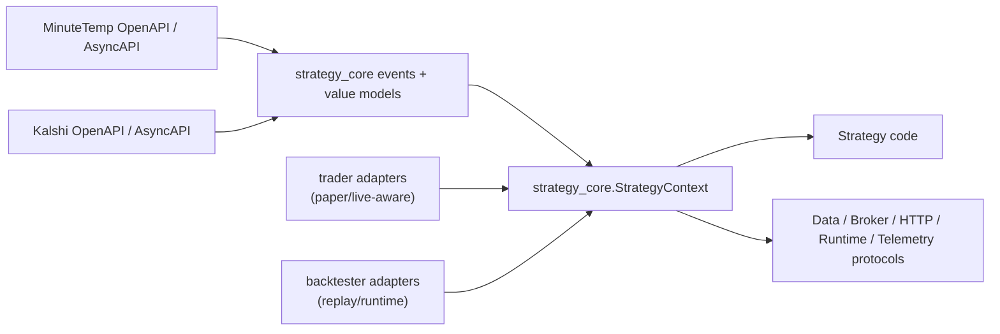

# Bootstrap standalone strategy-core shared contract package

## Overview

Create a new sibling Python package at `strategy-core/` that becomes the source of truth for strategy-facing types shared by `trader` and `backtester`. The package should define the canonical in-process `run(ctx)` contract, typed events, read-only state/view models, grouped data-query interfaces, broker/HTTP/runtime/telemetry protocols, and contract-level tests/documentation without carrying live-feed clients, replay engines, or paper-broker implementations.

This plan intentionally stops before refactoring either consumer repo to adopt the package. `trader` and `backtester` refactors will be planned separately once the shared contract exists.

## Problem Frame

The current strategy contract is real, but it is scattered across `trader` runtime modules such as `engine/context.py`, `engine/events.py`, `engine/state.py`, `engine/broker.py`, and `engine/data_access.py`. That coupling makes it difficult to use the same strategy code in `backtester` without either copying those modules or letting runtime-specific details leak into the shared authoring model.

The origin brainstorm explicitly chose a different direction: one standalone shared package first, then major runtime refactors around it. That decision matters because the user expects substantial `trader` reshaping rather than a small incremental extraction. This plan therefore treats existing `trader` code as a source of proven contract pieces, not as the final public API shape to preserve unchanged.

## Requirements Trace

- R8. The canonical shared interface is an in-process Python strategy contract, not a replay websocket protocol.
- R9. The contract must preserve the existing `run(ctx)` model: typed wake-up events, shared state reads, engine-owned fetch helpers, broker methods, and strategy config.
- R10. The same strategy should run in `trader` and `backtester` without being rewritten around different transport semantics.
- R11. Strategies must import strategy-facing types from a small shared package instead of from `trader` or `backtester` runtime modules.
- R12. The shared package contains contract/types only; runtime implementations stay repo-local.
- R18-R19. Engine-owned HTTP must be represented as part of the contract so runtimes can track completion and observability.
- R23-R36. The contract must encode runtime/capability/time/query/timer boundaries that were settled in the brainstorm.
- R37. Cross-runtime portability targets decision and order-intent parity, not exact fill/accounting equivalence.
- R51-R53. `StrategyContext` should stay narrow and nested, with telemetry as a first-class surface.
- R54. Build the standalone shared package first, then refactor both runtimes toward it.

## Scope Boundaries

- This plan creates the standalone shared package and its contract tests, but it does not switch `trader` or `backtester` imports yet.
- This plan does not implement live, paper, or replay runtime behavior. It defines interfaces only.
- This plan does not finalize PyPI publishing, semantic-versioning policy, or release automation for the new package.
- This plan does not extract every model currently present in `trader/engine/state.py`; it extracts only the strategy-visible value objects and view protocols needed for the first shared contract.
- This plan does not preserve direct raw queue access as part of the canonical API. One current strategy (`a_conv90`) still reaches into `ctx.queue`; that compatibility gap is documented here and handled in the later `trader` refactor plan.
- This plan does not design the `backtester` runtime, UI, replay storage, or hosted multi-tenant execution model.

## Context & Research

### Relevant Code and Patterns

- `trader/engine/context.py` is the current concrete `StrategyContext`, including `events()`, `ctx.state`, `ctx.broker`, `ctx.config`, and many top-level `fetch_*` helpers.
- `trader/engine/events.py` already defines spec-aligned immutable strategy-visible events using Pydantic models; it is the strongest extraction candidate for shared event types.
- `trader/engine/state.py` contains both strategy-visible value objects and runtime-only mutable/cache machinery. The shared package should copy only the value objects and read-only view protocols, not the whole `MarketState` implementation.
- `trader/engine/data_access.py` shows the current engine-owned query families, cache invalidation model, and the exact MinuteTemp reads current strategies rely on.
- `trader/engine/broker.py` contains the paper broker implementation plus the value types and methods strategies actually touch (`place_order`, positions, pending orders, cancels, sleeve buying power).
- `trader/strategies/forecast_pull_demo.py`, `trader/strategies/observation_bracket_demo.py`, and `trader/strategies/a_conv90.py` are the best contract consumers to design against because they exercise the current API in increasingly realistic ways.
- `trader/tests/engine/test_feeds.py`, `trader/tests/strategies/conftest.py`, and the strategy tests under `trader/tests/strategies/` show how the current contract is instantiated and mocked in tests.
- `backtester/pyproject.toml`, `backtester/AGENTS.md`, and `backtester/docs/plans/2026-04-06-001-feat-initial-python-project-setup-plan.md` establish the current convention for new Python repos in this workspace: `uv`, `ruff`, `mypy --strict`, `pytest`, committed `uv.lock`, and dated plan files.

### Institutional Learnings

- No `docs/solutions/` corpus exists in this workspace today, so the durable guidance for this plan comes from the origin brainstorm plus the existing repo conventions in `AGENTS.md`, `README.md`, and tests.

### External References

- No fresh external research was needed for this plan. The origin brainstorm already captured the governing external inputs:
  - MinuteTemp OpenAPI and AsyncAPI are the source of truth for upstream weather payloads and query families.
  - Kalshi OpenAPI and AsyncAPI are the source of truth for market/execution payloads.
  - Prior official-doc research in the brainstorm established the portability target as same strategy logic and order intents across runtimes, not exact fill/accounting parity.

## Key Technical Decisions

- **Create a new sibling repo named `strategy-core` with import package `strategy_core`.**
  This is the working repo/package name for planning and implementation. Rename/publishing mechanics can change later, but the plan needs a concrete root path.

- **Keep the shared package runtime-free.**
  `strategy-core` defines protocols, immutable models, and shared query objects only. Feed clients, cache implementations, SQLite state, replay orchestration, and exchange adapters stay in consumer repos.

- **Use a nested context surface with explicit service protocols.**
  The first-cut contract centers on `ctx.events()`, `ctx.state`, `ctx.data`, `ctx.broker`, `ctx.http`, `ctx.runtime`, `ctx.capabilities`, `ctx.config`, and `ctx.telemetry`, matching the brainstorm direction rather than preserving a flat method bag.

- **Represent sleeve-local identity as structured runtime/scope metadata, not raw queue plumbing.**
  Current strategies use `ctx.station`, `ctx.sleeve_id`, `ctx.tickers`, and `ctx.market_type`. The shared package should give those facts a structured home under runtime metadata or a scope value object. Follow-up consumer plans can provide temporary aliases if needed, but the canonical contract should not expose `ctx.queue`.

- **Keep spec-shaped payload models immutable and hand-authored.**
  Shared event models should remain close to the existing Pydantic approach in `trader/engine/events.py` so runtimes can deserialize upstream payloads directly. The contract should wrap those payloads in strategy-friendly types, but it should not try to generate the whole package directly from upstream specs.

- **Extract only the contract surface proven by current strategies/tests.**
  The first package version should cover the value models and methods used by `forecast_pull_demo`, `observation_bracket_demo`, `a_conv90`, and current strategy fixtures/tests. Rare or runtime-only helpers stay out until a consumer actually needs them.

- **Package as a normal Python library from day one.**
  Unlike `trader`, this repo exists specifically to be imported by other repos, so it should use a standard build backend, include `py.typed`, and keep dependency footprint minimal.

- **Document known migration gaps up front.**
  The shared package should explicitly call out that current `trader` strategies still use direct metadata fields and one strategy still reaches into `ctx.queue`. Those are consumer-adoption concerns, not reasons to pollute the shared contract.

## Open Questions

### Resolved During Planning

- **Should this plan create the shared package before refactoring `trader`?** Yes. The origin doc and latest user direction both prefer a standalone package first and expect a large `trader` refactor later.
- **What is the working repo/package name?** Use repo `strategy-core` and import package `strategy_core`.
- **Should the shared package preserve direct raw queue access?** No. The contract will model event iteration, engine-owned timers, and runtime metadata instead. `ctx.queue` remains a legacy `trader` detail to remove later.
- **How wide should the first extraction be?** Wide enough to support the current example strategies and existing strategy tests, but no wider.

### Deferred to Implementation

- **Exact final naming of runtime metadata fields.** The package needs a structured home for sleeve/station/ticker/market-type facts, but whether that is `ctx.runtime.scope`, `ctx.scope`, or another equivalent shape can be finalized during implementation.
- **Whether all typed value models stay in one module or split into submodules.** The plan assumes a few focused modules, but the exact file breakup can adjust if the first extraction lands cleaner another way.
- **How `ctx.http` request/response types should balance genericity vs ergonomics.** The contract must represent engine-owned HTTP, but exact request/response helper shape can be refined while implementing.
- **How much of the current `a_conv90` contract surface survives unchanged.** The later `trader` plan should decide whether to provide compatibility aliases or explicitly migrate strategy code to the new nested surface.
- **Publishing/versioning strategy for external consumers.** Path installs and editable local use are enough for the first cut.

## High-Level Technical Design

> *This illustrates the intended approach and is directional guidance for review, not implementation specification. The implementing agent should treat it as context, not code to reproduce.*



Proposed package shape:

```text
strategy-core/
  pyproject.toml
  README.md
  AGENTS.md
  .github/workflows/ci.yml
  strategy_core/
    __init__.py
    py.typed
    context.py
    capabilities.py
    runtime.py
    telemetry.py
    events.py
    state.py
    data.py
    queries.py
    broker.py
    http.py
    models.py
  tests/
    test_smoke.py
    test_context_contract.py
    test_event_models.py
    test_state_contract.py
    test_queries.py
    test_broker_contract.py
    test_http_contract.py
```

## Implementation Units

- [x] **Unit 1: Scaffold the standalone library repo**

**Goal:** Create a new sibling repo at `strategy-core/` with the same engineering discipline as `trader` and `backtester`, but shaped as a reusable typed library from day one.

**Requirements:** R11, R12, R54

**Dependencies:** None

**Files:**
- Create: `strategy-core/pyproject.toml`
- Create: `strategy-core/uv.lock`
- Create: `strategy-core/README.md`
- Create: `strategy-core/AGENTS.md`
- Create: `strategy-core/.github/workflows/ci.yml`
- Create: `strategy-core/strategy_core/__init__.py`
- Create: `strategy-core/strategy_core/py.typed`
- Test: `strategy-core/tests/test_smoke.py`

**Approach:**
- Follow the repo/tooling conventions already established in `backtester` and `trader`: `uv`, `ruff`, `mypy --strict`, `pytest`, committed `uv.lock`, and a simple CI workflow.
- Use a standard build backend suitable for a shared library and keep runtime dependencies minimal. The expected initial runtime dependency is `pydantic>=2` for immutable event/value models; do not pull in `httpx`, `aiosqlite`, or feed-specific libraries unless the contract truly requires them.
- Make `strategy_core` importable and typed as a standalone package without requiring either consumer repo to be present on `PYTHONPATH`.

**Patterns to follow:**
- `backtester/pyproject.toml`
- `backtester/AGENTS.md`
- `backtester/docs/plans/2026-04-06-001-feat-initial-python-project-setup-plan.md`
- `trader/pyproject.toml`

**Test scenarios:**
- Happy path: `import strategy_core` succeeds in a clean environment with only package dependencies installed.
- Happy path: the package exposes a stable top-level import surface for contract consumers.
- Error path: smoke import fails if the package accidentally imports `trader` or `backtester` runtime modules.
- Integration: CI runs `ruff check`, `ruff format --check`, `mypy`, and `pytest` successfully on a clean checkout with frozen dependency sync.

**Verification:**
- A new clone of `strategy-core` can `uv sync` and pass the full local/CI gate without requiring either sibling repo.

- [x] **Unit 2: Define the core context, runtime, capability, and telemetry protocols**

**Goal:** Establish the canonical `StrategyContext` shape and the small nested surfaces strategies should code against.

**Requirements:** R8-R12, R26-R36, R51-R53

**Dependencies:** Unit 1

**Files:**
- Create: `strategy-core/strategy_core/context.py`
- Create: `strategy-core/strategy_core/runtime.py`
- Create: `strategy-core/strategy_core/capabilities.py`
- Create: `strategy-core/strategy_core/telemetry.py`
- Create: `strategy-core/strategy_core/models.py`
- Test: `strategy-core/tests/test_context_contract.py`

**Approach:**
- Define `StrategyContext` as a protocol or abstract interface, not a concrete runtime dataclass.
- Keep the direct surface intentionally small: `events()`, `state`, `data`, `broker`, `http`, `runtime`, `capabilities`, `config`, and `telemetry`.
- Give sleeve-local identity and selection metadata a structured home in runtime metadata or an equivalent scope value object instead of exposing raw queue state as part of the contract.
- Model the initial runtime and capability set exactly as chosen in the brainstorm: small, explicit, and capability-first.
- Make telemetry a single nested surface that supports engine-aware logging, counters, gauges, and annotations without overcommitting to histograms or tracing yet.

**Patterns to follow:**
- `trader/engine/context.py`
- `trader/README.md` (`Strategy API` and queue semantics sections)
- `trader/tests/strategies/conftest.py`

**Test scenarios:**
- Happy path: a minimal fake implementation satisfies the `StrategyContext` protocol and can be passed to a stub `run(ctx)` function.
- Happy path: the context exposes the agreed nested surfaces without depending on runtime-specific classes from `trader` or `backtester`.
- Edge case: runtime metadata exposes only the v1 facts the brainstorm approved, while capability flags remain small and explicit.
- Error path: raw queue access is not required by the canonical contract.

**Verification:**
- Contract consumers can type-check against `StrategyContext` without importing any runtime implementation modules.

- [x] **Unit 3: Extract immutable event models and read-only state/view types**

**Goal:** Move the strategy-visible event vocabulary and the minimal read-only market/weather value objects into the shared package.

**Requirements:** R9, R10, R23-R25, R38, R51-R52

**Dependencies:** Unit 2

**Files:**
- Create: `strategy-core/strategy_core/events.py`
- Create: `strategy-core/strategy_core/state.py`
- Modify: `strategy-core/strategy_core/models.py`
- Test: `strategy-core/tests/test_event_models.py`
- Test: `strategy-core/tests/test_state_contract.py`

**Approach:**
- Copy/adapt the strategy-visible event models from `trader/engine/events.py` into the shared package, preserving spec-aligned field names and immutability so runtimes can continue to deserialize upstream payloads directly.
- Create read-only state/view protocols that expose only the helper methods strategies actually use today (`get_prices`, `get_weather`, `get_forecast`, `get_oracle_scores`), plus the typed value objects those methods return.
- Avoid extracting the mutable/cache-heavy parts of `MarketState`; keep those runtime-local.
- Use current example strategies and tests as the extraction boundary so the package stays intentionally narrow.

**Patterns to follow:**
- `trader/engine/events.py`
- `trader/engine/state.py`
- `trader/strategies/forecast_pull_demo.py`
- `trader/strategies/observation_bracket_demo.py`
- `trader/strategies/a_conv90.py`

**Test scenarios:**
- Happy path: representative `Observation`, `PriceUpdate`, `ForecastUpdated`, `ForecastVersions`, `OracleScoresUpdated`, `StationReport`, `WeatherEvent`, `NewHigh`, and `NewLow` payloads deserialize successfully.
- Happy path: extracted event models remain immutable after construction.
- Edge case: optional/null fields from upstream payloads continue to validate without custom runtime wrappers.
- Happy path: the shared state/view types are sufficient for current strategy reads without exposing runtime mutation methods.

**Verification:**
- A strategy author can import the shared event/value models and express current example-strategy read patterns without touching `trader.engine.*`.

- [x] **Unit 4: Define the grouped data client, query objects, broker protocol, and HTTP contract**

**Goal:** Encode the engine-owned request surfaces strategies rely on today, but as shared interfaces instead of `trader` runtime helpers.

**Requirements:** R18-R19, R25, R30-R33, R35-R37, R51-R52

**Dependencies:** Units 2 and 3

**Files:**
- Create: `strategy-core/strategy_core/data.py`
- Create: `strategy-core/strategy_core/queries.py`
- Create: `strategy-core/strategy_core/broker.py`
- Create: `strategy-core/strategy_core/http.py`
- Modify: `strategy-core/strategy_core/models.py`
- Test: `strategy-core/tests/test_queries.py`
- Test: `strategy-core/tests/test_broker_contract.py`
- Test: `strategy-core/tests/test_http_contract.py`

**Approach:**
- Replace the flat top-level `ctx.fetch_*` design with a grouped `ctx.data` client while preserving the current useful query families and filters. The first contract should cover the families real strategies currently use: forecast, forecast runs, forecast run detail, oracle scores, reports, latest observation, and limits.
- Support both simple kwargs and typed query objects so current ergonomic calls stay easy while more reusable filter shapes remain explicit.
- Define a broker protocol around the methods real strategies use today: `place_order`, `cancel_order`, `cancel_all_orders`, `get_position`, `get_positions`, `get_pending_orders`, and `get_sleeve_buying_power`, plus shared value objects such as positions, pending orders, and order results.
- Define a minimal engine-owned HTTP interface that is generic enough for both runtimes to implement later, but does not bake in replay policy or a specific async client library.
- Keep timer and clock behavior referenced through runtime protocols rather than smuggling them into broker or HTTP interfaces.

**Patterns to follow:**
- `trader/engine/data_access.py`
- `trader/engine/broker.py`
- `trader/strategies/helpers/runtime.py`
- `trader/tests/strategies/conftest.py`

**Test scenarios:**
- Happy path: each supported data family can be expressed both with direct kwargs and with a typed query object.
- Happy path: the broker contract covers current strategy operations for market entries, exits, cancels, and position inspection.
- Edge case: optional query parameters can be omitted cleanly without requiring placeholder values.
- Error path: the shared contract does not require concrete `httpx` or replay-engine types to satisfy the HTTP interface.
- Integration: a fake strategy using `ctx.data`, `ctx.broker`, and `ctx.http` type-checks entirely against `strategy_core`.

**Verification:**
- The contract package exposes a complete strategy-facing request surface for current example strategies without embedding any runtime implementation.

- [x] **Unit 5: Publish the contract map and migration guidance for consumer repos**

**Goal:** Make later `trader` and `backtester` refactor plans faster and safer by documenting exactly what moved, what did not, and which compatibility gaps remain.

**Requirements:** R10-R12, R31, R51-R54

**Dependencies:** Units 1-4

**Files:**
- Modify: `strategy-core/README.md`
- Create: `strategy-core/docs/contract-map.md`
- Test: `strategy-core/tests/test_smoke.py`

**Approach:**
- Document the public import surface for strategy authors, including the intended top-level `ctx` shape and the nested service boundaries.
- Add a migration map from current `trader` modules to new shared-package modules so the later `trader` and `backtester` plans can focus on runtime adaptation rather than rediscovering extraction intent.
- Call out known adoption gaps explicitly:
  - current strategies still use direct metadata fields such as `ctx.station`
  - `a_conv90` still reads `ctx.queue` directly for heartbeat behavior
  - consumer repos will need temporary aliases or intentional strategy migrations
  - runtime implementations, replay semantics, and provider adapters remain local to each consumer repo
- Include an editable local-dependency example for sibling-repo development without turning publishing/versioning into a blocker.

**Patterns to follow:**
- `trader/README.md`
- `backtester/README.md`
- `backtester/docs/brainstorms/2026-04-07-trader-backtester-shared-interface-requirements.md`

**Test scenarios:**
- Happy path: README examples import only from `strategy_core`.
- Integration: the migration map covers the example strategies and the contract modules they will need during consumer adoption.
- Error path: docs do not imply that `strategy-core` contains feed clients, broker engines, or replay implementations.

**Verification:**
- A future implementer can open the repo and understand both the shared contract and the remaining adoption work without revisiting the full brainstorm transcript.

## System-Wide Impact

- **Interaction graph:** This package becomes a new dependency for `trader`, `backtester`, and any future private strategy repo. It will sit at the center of strategy authoring, so blast radius is high even though no runtime behavior lives here.
- **Error propagation:** The package should avoid inventing a deep custom exception hierarchy. Runtime-specific failures still belong to consumer repos; the shared contract mainly standardizes interfaces and value objects.
- **State lifecycle risks:** Extracting too much mutable/cache logic from `trader/engine/state.py` would make the shared package bloated and unstable. Keeping only read-only view/value types preserves a cleaner boundary.
- **API surface parity:** The contract must stay equally usable by a paper-trading runtime and a replay runtime. Any consumer-specific convenience that breaks that symmetry should remain outside the shared package.
- **Integration coverage:** The strongest pre-adoption proof is contract-level coverage against the current example strategies and existing strategy test fixtures.
- **Unchanged invariants:** The engine remains the mandatory control plane for data, orders, HTTP, and timers. This plan changes where strategy-facing types live, not who owns side effects or transport.

## Risks & Dependencies

| Risk | Mitigation |
|------|------------|
| Over-extracting runtime behavior from `trader` into the shared package | Limit the first cut to protocols, immutable models, and the value objects current strategies/tests actually need |
| Freezing the wrong context shape and forcing unnecessary churn later | Keep the top-level `ctx` narrow, document unresolved naming details as implementation-time decisions, and use current strategy usage plus the origin doc as the acceptance boundary |
| Current `trader` strategies rely on direct metadata fields and one uses `ctx.queue` | Document the gap explicitly and handle compatibility shims or migrations in the later `trader` refactor plan |
| Package exists but drifts before either consumer adopts it | Make the `trader` refactor plan the immediate next follow-up and include contract-map documentation/tests that lock the intended surface |
| Shared models drift from MinuteTemp/Kalshi upstream payloads | Preserve spec-aligned field names, use representative payload tests, and treat upstream specs as the source of truth for data shapes rather than runtime surfaces |

## Documentation / Operational Notes

- The follow-up `trader` refactor plan should treat this package as a hard prerequisite and explicitly decide how to bridge from current direct `ctx.*` metadata fields to the new shared contract.
- The follow-up `backtester` plan should consume this package rather than inventing an alternate strategy contract surface.
- Local sibling-repo development should use editable/path installs first. Publishing/versioning automation can wait until after at least one consumer repo is successfully migrated.
- Any future expansion of the contract should be driven by consumer runtime needs and protected by contract-level tests, not by copying more of `trader` wholesale.
