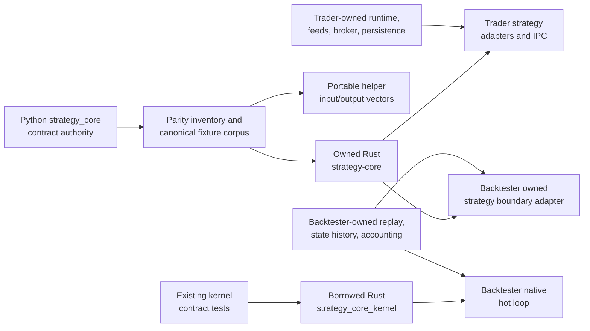

# feat: Complete Rust/Python strategy contract parity

## Overview

Complete semantic parity between the Python `strategy_core` package and the broad Rust
`strategy-core` crate, prove that parity with a Python-authored conformance corpus, and finish the
strategy-facing adoption work in Trader and Backtester. The narrow `strategy_core_kernel` crate
remains the allocation-sensitive hot-loop contract; replay, feed, broker execution, persistence,
and lifecycle behavior remain consumer-owned.

The work is complete when equivalent Python and Rust contract objects have the same structural JSON
shape and validation behavior, portable helpers produce the same results, and both consumer runtimes
translate their engine-owned state into the shared contract without maintaining competing
strategy-facing definitions.

## Problem Frame

The Python and Rust packages now expose nearly the same module and public-type inventory, but most
parity evidence consists of parallel hand-written tests. Those tests can both pass while defaults,
nullability, enum names, timestamps, trait behavior, or validation rules drift. One confirmed drift
already exists: Python `MarketStateView.get_oracle_scores` supports `days`, `mode`, and `rank_by`
selectors, while the Rust trait omits them.

Trader already consumes the broad Rust crate and demonstrates a useful shared-fixture pattern, but
its cross-language event coverage is incomplete. Backtester consumes only the narrow kernel crate,
maintains engine-local replay models, manually rebuilds Python shared state at the PyO3 boundary, and
duplicates portable fee math. The replay-owned models are legitimate, but the strategy-facing
projection should be shared.

There is no separate requirements document. The planning source of truth is the user's request plus
`docs/rust-parity-strategy-core.md` and `docs/contract-map.md`.

## Requirements Trace

### Contract definition and evidence

- **R1. Public contract inventory:** Every public Python contract surface must be classified as
  broad Rust parity-required, kernel-only, Python-only by design, or consumer-owned.
- **R2. Serializable parity:** Every parity-required model, enum, and value object must be covered by
  Python-authored fixtures that Rust can deserialize and serialize to the same structural JSON value.
- **R3. Behavioral parity:** Portable helpers and trait semantics must have shared input/output or
  error vectors, including the known oracle-score selector drift.
- **R4. Compatibility behavior:** Tests must distinguish omitted fields, explicit `null`, defaults,
  non-default optionals, enum values, timestamp formatting, numeric boundaries, and invalid payloads.

### Consumer adoption and ownership

- **R5. Trader adoption:** Every Trader-supported strategy event and shared state/broker boundary must
  be exercised through both its Rust protocol layer and Python adapter.
- **R6. Backtester adoption:** Backtester must project replay-owned state into broad shared types at
  strategy boundaries while retaining replay timelines, read fences, provenance, ordering, and lazy
  hydration internally.
- **R7. Fee ownership:** Backtester must delegate portable fee calculations to `strategy_core::fees`
  while keeping replay accounting and zero-fee policy local.

### Certification and compatibility

- **R8. Required gates and documentation:** Existing Python and Rust test gates must discover the
  conformance suite, and the parity/status documentation must state what is complete and what remains.
- **R9. Backward compatibility:** Existing Python strategy behavior, Rust kernel behavior, and
  strategy-visible field names/defaults must remain stable unless a fixture first demonstrates an
  intentional coordinated change.

## Scope Boundaries

- Do not move replay ordering, mutable caches, read fences, persistence, live/paper execution, risk,
  reconciliation, provider clients, or lifecycle supervision into Strategy Core.
- Do not replace Backtester's engine-internal replay records merely because they resemble shared
  value objects; add explicit boundary projections instead.
- Do not widen `strategy_core_kernel` into the owned broad contract or introduce allocations into its
  borrowed event/state views solely for conformance.
- Do not redesign the Python async `StrategyContext` or require language-identical trait signatures;
  parity is semantic and wire-level where language mechanics differ.
- Do not require byte-for-byte JSON key ordering. Structural equality is authoritative, while field
  presence, `null`, enum strings, timestamp strings, and numeric values remain significant.
- Do not add a schema/code-generation framework or a new third-party runtime dependency to Strategy
  Core unless implementation proves the fixture-based approach insufficient. The planned sibling
  `strategy-core` path dependency in Backtester is explicitly allowed.
- Do not introduce cross-repository release publishing or packaging work; current path-dependency and
  normal package workflows remain in scope.

## Context & Research

### Relevant Code and Patterns

- Python 3.12+, Pydantic 2, dataclasses, pytest, strict mypy, and Ruff are configured in
  `pyproject.toml`; Rust uses edition 2024 and Rust 1.85 in `native/strategy_core/Cargo.toml`.
- Python public exports live in `strategy_core/__init__.py`; broad Rust exports live in
  `native/strategy_core/src/lib.rs`; kernel exports live in `native/strategy_core_kernel/src/lib.rs`.
- Existing Python contract tests live under `tests/`; broad Rust tests are concentrated in
  `native/strategy_core/tests/contract.rs` and `native/strategy_core/tests/interface.rs`.
- Trader's shared-fixture precedent is
  `../trader/native/crates/trader-bot-ipc/tests/fixtures/bot_ipc/`, consumed by
  `../trader/tests/test_bot_ipc_conformance.py` and
  `../trader/native/crates/trader-bot-ipc/tests/conformance_contract.rs`.
- Trader already declares the broad dependency in `../trader/native/Cargo.toml` and uses shared state,
  events, freshness, and broker types across its Rust crates.
- Backtester currently declares only `strategy-core-kernel` in
  `../backtester/native/backtester_core/Cargo.toml`. Its replay-owned state lives in
  `../backtester/native/backtester_core/src/state.rs`, strategy projection in `kernel_runner.rs`,
  Python bridge in `../backtester/native/backtester_python/src/lib.rs`, and fee logic in
  `../backtester/native/backtester_core/src/broker.rs`.
- Strategy Core CI already runs Python 3.12/3.13 tests and Rust workspace formatting/tests in
  `.github/workflows/ci.yml`; conventional test discovery should remain the primary gate.

### Institutional Learnings

- No `docs/solutions/` or `critical-patterns.md` corpus exists in Strategy Core, Trader, or
  Backtester. This plan is grounded in current code, tests, and contract documentation.
- Preserve Trader's repository convention that public strategy modules import `strategy_core`, not
  runtime internals.
- Treat Backtester plans and brainstorms as historical when they conflict with current code or
  operator documentation.

### External References

- External research was intentionally skipped. The task uses established local Serde, Pydantic,
  pytest, and Cargo patterns, and no new framework or external protocol is being introduced.

## Key Technical Decisions

- **Python remains the contract authority:** Canonical fixtures are constructed from Python objects,
  because the current documentation explicitly names Python as the complete source contract. Authority
  is not an instruction to copy accidental behavior: each newly discovered mismatch is characterized
  in Python, Rust, and affected consumers, then classified as Python-canonical, an intentional
  coordinated change, or an intentional language-specific divergence before production code changes.
- **Use an explicit coverage manifest:** Every public surface is classified and linked to a fixture,
  behavior vector, trait test, or intentional exclusion. Each entry records two independent dimensions:
  ownership/parity class (`broad-parity-required`, `kernel-only`, `python-only`, or `consumer-owned`)
  and evidence mechanism (`fixture`, `helper-vector`, `trait-test`, or `intentional-exclusion`).
  Parity-required entries also enumerate applicable evidence dimensions—non-default round trip,
  defaults, omission, explicit null, enum/timestamp/numeric boundaries, invalid input, helper/trait
  behavior, and consumer boundaries—with a rationale for every not-applicable dimension.
- **Bound validation parity to the public wire contract:** Compare JSON-compatible representations
  intended for serialized contract use. Parity means the same accept/reject result and, when accepted,
  the same canonical value; rejected cases compare normalized categories such as required-field, type,
  enum, range, and format errors, not exact diagnostic text. Per-family manifest policy records
  coercions, unknown-field handling, omitted-versus-null behavior, and intentional constructor-only
  language differences.
- **Compare structural JSON values:** Key ordering and whitespace are irrelevant; field presence,
  `null`, default values, enum strings, timestamps, and numeric semantics are contract behavior.
- **Separate broad and kernel evidence:** Broad fixtures cover owned portable objects. Kernel-only
  manifest entries reference the existing borrowed-view/action contract tests; add focused kernel
  regression cases only when parity work changes a kernel interface. Do not create a second kernel
  serialization corpus or force the broad model into the hot loop.
- **Make additive compatibility explicit:** New serialized fields must be optional or defaulted on the
  receiving side unless all consumers change together. Unknown object fields follow the per-family
  policy recorded in the manifest; unknown enum or event variants must fail explicitly rather than
  silently changing meaning.
- **Fix semantic drift before migrating consumers:** The known oracle selector mismatch and any other
  inventory findings land before Trader/Backtester consume the completed contract.
- **Adopt at strategy boundaries, not storage boundaries:** Backtester keeps replay-specific records
  and policies; a dedicated adapter projects complete broad shared objects when state crosses into a
  Python or owned Rust strategy surface.
- **Do not duplicate CI work:** New pytest and Cargo integration tests should be discovered by the
  existing jobs. Add a separate workflow step only if the implemented fixture verification cannot be
  expressed through normal test discovery.

## Open Questions

### Resolved During Planning

- **Which language defines the contract?** Python remains authoritative until the parity document is
  deliberately revised.
- **Does parity require identical APIs?** No. Rust and Python may express protocols differently, but
  selectors, defaults, results, errors, and serialized shapes must match semantically.
- **Should consumer-local records be deleted?** No. Only competing strategy-facing representations
  are replaced; engine-owned operational state remains local.
- **Should the kernel absorb broad models?** No. Kernel conformance remains separate and preserves its
  borrowed hot-loop design.
- **Should JSON comparisons be byte-for-byte?** No. Compare parsed values structurally while keeping
  field presence and values strict.
- **What does validation parity include?** The public JSON-compatible wire domain, canonical accepted
  values, and normalized error categories. Arbitrary language-specific constructor coercions and exact
  error strings are excluded unless a consumer depends on them.
- **Does Python authority automatically win every mismatch?** No. Characterize both implementations
  and affected consumers, record the compatibility rationale in the manifest, then establish the
  canonical fixture or intentional exclusion before changing production code.

### Deferred to Implementation

- **Additional field or trait drift:** The coverage-manifest and fixture work may expose mismatches
  beyond `get_oracle_scores`; record each as an explicit parity fix rather than silently normalizing it
  in tests.
- **Trader event support matrix:** `forecast_versions`, `timer_wake`, and `shutdown` are not present in
  the current runtime mapping. Confirm whether each is intentionally generated elsewhere or truly
  unsupported before changing `runtime_driver.rs`; in either case, document and test the policy.
- **Backtester Python crate dependency:** Add a direct broad `strategy-core` dependency to
  `backtester_python` only if its final adapter imports shared Rust types directly rather than through
  `backtester_core`.
- **Fixture grouping:** Choose the smallest grouping that keeps reviews readable after the complete
  public inventory is known; do not create one file per trivial alias when a nested aggregate fixture
  proves the same type.

## High-Level Technical Design

> *This illustrates the intended approach and is directional guidance for review, not implementation
> specification. The implementing agent should treat it as context, not code to reproduce.*

## Phased Delivery

### Phase 1: Make the shared contract measurable

- Units 1-3 establish the inventory, close core drift, and create authoritative fixtures/vectors.

### Phase 2: Complete consumer adoption

- Unit 4 finishes Trader boundary evidence.
- Units 5-7 migrate Backtester's owned strategy boundary and portable fee math without changing replay
  ownership.

### Phase 3: Certify completion

- Unit 8 confirms all existing gates discover the new coverage and reconciles the documentation.

## Implementation Units

- [x] **Unit 1: Establish the parity inventory and close known trait drift**

**Goal:** Create an enforceable inventory for every public Python/Rust surface and align Rust
`MarketStateView.get_oracle_scores` with the Python selector semantics before consumers migrate.

**Requirements:** R1, R3, R4, R9

**Dependencies:** None

**Files:**
- Create: `tests/fixtures/conformance/manifest.json`
- Create: `tests/test_rust_conformance.py`
- Reference: `strategy_core/__init__.py`
- Reference: `strategy_core/state.py`
- Modify: `native/strategy_core/src/state.rs`
- Reference: `native/strategy_core/src/lib.rs`
- Modify/Test: `native/strategy_core/tests/interface.rs`
- Test: `tests/test_state_contract.py`

**Approach:**
- Classify every exported Python and Rust symbol on both manifest dimensions: ownership/parity class
  and evidence mechanism. Record all applicable evidence dimensions and justify each not-applicable
  dimension so one aggregate happy-path fixture cannot overstate completeness.
- Treat aliases and Rust-specific error types as explicit classifications rather than false drift.
- Add Rust-side optional selector inputs for oracle score reads that preserve Python's existing
  behavior: omitted selectors return the station's current score set; explicit selectors match the
  stored `days_requested`, `score_mode`, and `rank_by` metadata; mismatches return no result.
- Keep selection in the broad state trait. Do not add it to `strategy_core_kernel` or invent ranking
  computation that Python does not perform at this boundary.

**Execution note:** Start with inventory and selector characterization tests before modifying the Rust
trait.

**Patterns to follow:**
- Python protocol behavior in `strategy_core/state.py` and `tests/fakes.py`.
- Query/default modeling in `strategy_core/queries.py` and `native/strategy_core/src/queries.rs`.
- Rust trait fake implementation in `native/strategy_core/tests/interface.rs`.

**Test scenarios:**
- Happy path: every exported symbol appears exactly once with valid ownership/parity and evidence
  classifications plus complete applicable-evidence metadata.
- Happy path: omitted oracle selectors return the available station score set in both languages.
- Happy path: matching `days`, `mode`, and `rank_by` selectors return the same score set.
- Edge case: integer and string day selectors normalize to the same stored `days_requested` value.
- Edge case: any mismatched selector returns no score set without mutating state.
- Edge case: a missing station remains missing regardless of selectors.
- Error path: an unknown manifest classification, a missing applicable-evidence rationale, or a
  reference to a non-exported symbol fails the completeness test.

**Verification:**
- The manifest accounts for the full public surface and the known state-trait drift is covered by
  matching Python and Rust behavior tests.

- [x] **Unit 2: Add the core Python-authored conformance corpus**

**Goal:** Establish one canonical fixture corpus that proves Python-to-Rust structural serialization
parity for the core contract surface.

**Requirements:** R2, R4, R9

**Dependencies:** Unit 1

**Files:**
- Create: `tests/conformance_cases.py`
- Create: `tests/fixtures/conformance/events.json`
- Create: `tests/fixtures/conformance/state.json`
- Create: `tests/fixtures/conformance/broker.json`
- Create: `tests/fixtures/conformance/runtime.json`
- Create: `tests/fixtures/conformance/queries.json`
- Modify/Test: `tests/test_rust_conformance.py`
- Create/Test: `native/strategy_core/tests/conformance.rs`
- Modify/Test: `native/strategy_core/tests/contract.rs`
- Modify/Test: `native/strategy_core/tests/interface.rs`

**Approach:**
- Construct canonical cases from Python objects and compare them with checked-in parsed JSON values.
  Fixture verification must be read-only in normal test runs so CI fails on drift rather than rewriting
  artifacts.
- Have Rust deserialize each Python-authored valid case into the named shared type, serialize it back
  to a JSON value, and compare structurally with the fixture.
- Cover all 11 `StrategyEvent` variants and all parity-required state/freshness, broker,
  runtime/capability, query, model-alias, and native-result types. Nested aggregate cases may satisfy
  multiple manifest entries when that coverage is explicit.
- Classify kernel-only surfaces in the manifest and link them to existing named kernel contract tests.
  Add a focused kernel regression only when a parity fix changes a kernel interface; do not create a
  new kernel fixture corpus or force borrowed types through the owned broad serializer.

**Execution note:** Implement the fixture harness and first failing round trips before correcting any
newly exposed production drift.

**Patterns to follow:**
- Trader's dual Python/Rust fixture readers in
  `../trader/tests/test_bot_ipc_conformance.py` and
  `../trader/native/crates/trader-bot-ipc/tests/conformance_contract.rs`.
- Existing Rust JSON-shape assertions in `native/strategy_core/tests/contract.rs`.
- Existing event validation tests in `tests/test_event_models.py`.

**Test scenarios:**
- Happy path: every event variant round-trips through its Rust type with the same discriminator and
  nested payload.
- Happy path: full non-default state, freshness, broker, runtime, capability, and query objects retain
  every field.
- Edge case: default-only objects match Python defaults after Rust deserialization.
- Edge case: omitted optional fields and explicit `null` remain distinct wherever the Python wire
  contract distinguishes them.
- Edge case: UTC timestamps, offsets, sub-second precision, empty lists/maps, zero values, large
  quantities, and `-0.0` follow the chosen structural contract.
- Error path: within each family’s declared wire-domain policy, missing or blank required fields,
  wrong event discriminators, unknown enum values, applicable non-finite or out-of-range numbers, and
  malformed nested objects produce the same accept/reject result and normalized error category.
- Integration: the manifest fails if a parity-required public type lacks fixture or behavior coverage.

**Verification:**
- Python and broad Rust tests consume the same checked-in corpus, and every core parity-required
  manifest entry has positive and applicable negative coverage.

- [x] **Unit 3: Complete helper and external-model conformance**

**Goal:** Extend the same authority model to portable helper behavior and the complete public
MinuteTemp, Kalshi, data, and HTTP model families.

**Requirements:** R1, R2, R3, R4, R9

**Dependencies:** Unit 2

**Files:**
- Create: `tests/fixtures/conformance/helpers.json`
- Create: `tests/fixtures/conformance/minutetemp.json`
- Create: `tests/fixtures/conformance/kalshi.json`
- Create: `tests/fixtures/conformance/http-data.json`
- Modify/Test: `tests/test_rust_conformance.py`
- Modify/Test: `native/strategy_core/tests/conformance.rs`
- Modify/Test: `tests/test_fees.py`
- Modify/Test: `tests/test_stations.py`
- Modify/Test: `tests/test_climate_day.py`
- Modify/Test: `tests/test_kalshi_models.py`
- Modify/Test: `tests/test_minutetemp_models.py`
- Modify/Test: `native/strategy_core/tests/contract.rs`
- Modify/Test: `native/strategy_core/tests/interface.rs`
- Modify as drift is exposed: `strategy_core/fees.py`, `strategy_core/stations.py`,
  `strategy_core/climate_day.py`, `strategy_core/kalshi.py`, `strategy_core/minutetemp.py`,
  `strategy_core/http.py`, `strategy_core/data.py`
- Modify as drift is exposed: `native/strategy_core/src/fees.rs`,
  `native/strategy_core/src/stations.rs`, `native/strategy_core/src/climate_day.rs`,
  `native/strategy_core/src/kalshi.rs`, `native/strategy_core/src/minutetemp.rs`,
  `native/strategy_core/src/http.rs`, `native/strategy_core/src/data.rs`

**Approach:**
- Represent helper parity as shared input/result-or-error vectors rather than serialized object
  fixtures.
- Require every public serializable MinuteTemp/Kalshi/data/HTTP type to be named in the manifest.
  Use aggregate payloads to cover nested types, plus targeted cases for defaults and validation.
- Preserve upstream field names and current Python behavior. Any discrepancy discovered by the corpus
  enters the mismatch-adjudication gate: characterize Python, Rust, and affected consumers; record the
  canonical or intentional-divergence decision and compatibility impact; add the fixture/vector; only
  then make an explicit production fix with a focused regression case.

**Patterns to follow:**
- Existing paired fee examples in `tests/test_fees.py` and
  `native/strategy_core/tests/contract.rs`.
- Existing paired station/climate-day examples in `tests/test_stations.py`,
  `tests/test_climate_day.py`, and `native/strategy_core/tests/interface.rs`.
- Current Pydantic/Serde model tests for Kalshi and MinuteTemp.

**Test scenarios:**
- Happy path: fee, station, climate-day, and signal vectors produce the same Python/Rust result.
- Edge case: fee roles/types/multipliers, cent rounding boundaries, invalid decimal values, unknown fee
  types, unknown stations, date parsing formats, and timezone day boundaries match.
- Happy path: every public MinuteTemp and Kalshi model is covered directly or through an explicit
  aggregate case.
- Edge case: nested orderbook shapes, optional cursors, empty pages, custom strike ranges, report
  schedule variants, and day-bucketing defaults survive round trips.
- Error path: invalid enum strings, missing required nested objects, invalid HTTP methods, and malformed
  upstream payloads fail consistently.
- Integration: manifest coverage cannot be marked complete by a fixture that never exercises the
  named nested type.

**Verification:**
- The parity inventory has no unclassified broad public surfaces and shared helper vectors pass in both
  languages.

- [x] **Unit 4: Complete Trader boundary conformance**

**Goal:** Prove every Trader-supported shared event and strategy boundary through both Rust protocol
decoding and the Python adapter, while making unsupported-event behavior explicit.

**Requirements:** R5, R8, R9

**Dependencies:** Units 2-3

**Files:**
- Create/extend fixtures under:
  `../trader/native/crates/trader-bot-ipc/tests/fixtures/bot_ipc/`
- Candidate fixtures to create after the support matrix is confirmed:
  `event_deliver_observation.json`, `event_deliver_forecast_versions.json`,
  `event_deliver_oracle_scores_updated.json`, `event_deliver_weather_event.json`,
  `event_deliver_new_high.json`, `event_deliver_new_low.json`, `event_deliver_timer_wake.json`,
  `event_deliver_shutdown.json`
- Modify/Test: `../trader/tests/test_bot_ipc_conformance.py`
- Modify/Test: `../trader/native/crates/trader-bot-ipc/tests/conformance_contract.rs`
- Modify/Test: `../trader/native/crates/trader-bot-ipc/tests/protocol_contract.rs`
- Modify if support is missing: `../trader/native/crates/trader-feed/src/runtime_driver.rs`
- Test: `../trader/native/crates/trader-feed/tests/bot_runtime_e2e_contract.rs`

**Approach:**
- Build an explicit matrix for all 11 shared event variants: produced by Trader, consumed only,
  generated by runtime control flow, or intentionally unsupported.
- Align each composite IPC fixture's nested `strategy_event` with the canonical Strategy Core fixture.
- Add both Python and Rust assertions for every supported event. For intentionally unsupported events,
  assert the existing explicit rejection/quarantine policy instead of silently dropping them.
- Keep deduplication, ordering, state sequencing, and provider-envelope behavior Trader-owned.

**Execution note:** Expand one event family at a time from the existing price, station-report, and
forecast fixtures.

**Patterns to follow:**
- Existing fixtures and dual-language conformance tests listed above.
- Current canonical event mapping in `../trader/native/crates/trader-feed/src/runtime_driver.rs`.

**Test scenarios:**
- Happy path: every Trader-supported event decodes to the expected shared Rust variant and Python event
  model with identical strategy-visible fields.
- Integration: each event is applied to local state before it becomes visible to the Python strategy,
  preserving the existing state/event sequencing invariant.
- Edge case: optional shared fields may be omitted, and unknown additive object fields follow current
  forward-compatible behavior.
- Error path: unknown event discriminators, malformed required fields, and explicitly unsupported
  events enter the documented failure/quarantine path.
- Regression: existing price, station-report, forecast, broker, bootstrap, and resync fixtures remain
  valid.

**Verification:**
- The event support matrix has no implicit gaps and every supported family is exercised through both
  language adapters.

- [x] **Unit 5: Add Backtester's broad Strategy Core projection adapter**

**Goal:** Introduce one owned strategy-boundary adapter that projects replay state into complete broad
shared Rust objects without replacing replay-owned storage or the kernel hot loop.

**Requirements:** R6, R9

**Dependencies:** Units 1-3

**Files:**
- Modify: `../backtester/native/Cargo.toml`
- Modify: `../backtester/native/backtester_core/Cargo.toml`
- Modify: `../backtester/native/Cargo.lock`
- Create: `../backtester/native/backtester_core/src/strategy_core_adapter.rs`
- Modify: `../backtester/native/backtester_core/src/lib.rs`
- Reference/modify projection call sites: `../backtester/native/backtester_core/src/state.rs`
- Reference/modify as source availability requires:
  `../backtester/native/backtester_core/src/replay/book.rs`,
  `../backtester/native/backtester_core/src/replay/records.rs`, and
  `../backtester/native/backtester_core/src/replay/clickhouse.rs`
- Modify: `../backtester/native/backtester_core/src/kernel_runner.rs`
- Create/Test:
  `../backtester/native/backtester_core/tests/strategy_core_adapter_contract.rs`
- Modify/Test: `../backtester/native/backtester_core/tests/kernel_runner_contract.rs`
- Modify/Test: `../backtester/native/backtester_core/tests/replay_inputs_contract.rs`

**Approach:**
- Add the broad Strategy Core dependency alongside the existing kernel dependency.
- Regenerate and commit `native/Cargo.lock` immediately after changing the workspace dependency graph;
  Backtester’s native CI runs Cargo with `--locked`.
- Centralize conversion from replay-owned price, weather, forecast, oracle, and freshness records into
  `TickerPrices`, `StationWeather`, `StationForecast`, `StationOracleScores`, and freshness objects.
- Characterize source availability for every shared field. When raw replay inputs carry values that
  the current price projection drops—potentially series ticker, fee metadata, volume, or peak ask—thread
  them through the existing replay projection/state path before adapting them. When the source truly
  lacks a value, use the Python contract’s absent/default representation and record that intentional
  unavailability in the manifest; never synthesize data solely to make the object look complete.
- Keep microsecond timestamps, provenance candidates, timelines, read fences, lazy hydration, and
  replay normalization in Backtester-owned types.
- Continue using borrowed kernel views/actions for native hot-loop dispatch; the new adapter is for
  owned strategy-facing state and events.

**Execution note:** Add characterization coverage for current replay projections before centralizing
them.

**Patterns to follow:**
- Trader's projections into shared types in
  `../trader/native/crates/trader-core/src/state_snapshot.rs` and
  `../trader/native/crates/trader-core/src/minutetemp_state.rs`.
- Backtester's existing view construction in `kernel_runner.rs`.

**Test scenarios:**
- Happy path: a complete replay price record maps every source-available shared `TickerPrices` field,
  including values that had to be retained earlier in the replay projection path.
- Happy path: weather, forecast, oracle, and freshness records map timestamps, defaults, nested values,
  and source metadata correctly.
- Edge case: absent optional data remains absent rather than becoming zero or an empty string unless
  the Python contract defines that default.
- Edge case: a shared field absent from the replay source uses the canonical Python default and has a
  manifest rationale rather than a fabricated value.
- Edge case: empty forecast/oracle collections produce valid empty shared objects where Python does.
- Error path: out-of-range timestamps or invalid source values produce an explicit adapter error and do
  not partially publish state.
- Regression: native kernel views preserve their current borrowed fields and event ordering.
- Integration: replay-owned state changes are reflected in the next owned shared projection without
  changing replay persistence or read-fence behavior.

**Verification:**
- Backtester has one tested broad projection boundary; each shared field is traceable to a replay source
  or an intentional default, while replay ownership and kernel dispatch remain architecturally unchanged.

- [x] **Unit 6: Route Backtester's Python bridge through canonical projections**

**Goal:** Ensure Python strategies and owned Rust consumers observe the same shared state values from a
single Backtester projection path.

**Requirements:** R6, R9

**Dependencies:** Unit 5

**Files:**
- Modify: `../backtester/native/backtester_python/Cargo.toml` only if direct shared imports are needed
- Modify: `../backtester/native/backtester_python/src/lib.rs`
- Modify: `../backtester/native/backtester_core/src/strategy_core_adapter.rs`
- Create/Test:
  `../backtester/native/backtester_python/tests/strategy_core_bridge_contract.rs`
- Test: `../backtester/tests/test_parity.py`
- Test: `../backtester/tests/test_state.py`

**Approach:**
- Replace independent field-by-field reconstruction from replay records with construction from the
  canonical broad adapter output.
- Keep the final PyO3 creation of Python dataclasses/protocol values in the Python bridge, but make the
  broad Rust object the sole source of strategy-visible values.
- Validate bridge output against the same canonical expectations as the Strategy Core fixture corpus.

**Patterns to follow:**
- Existing Python dataclass construction in `native/backtester_python/src/lib.rs`.
- Strategy Core state fixtures established by Units 2-3.

**Test scenarios:**
- Integration: the same replay input produces equivalent Rust shared state and Python
  `strategy_core.state` objects for price, weather, forecast, oracle, and freshness.
- Edge case: `None`, empty collections, timestamps, enum/string fields, and nested hourly forecasts
  remain identical across the PyO3 boundary.
- Error path: a projection conversion error reaches the Python bridge as an explicit failure rather
  than publishing a partially defaulted object.
- Regression: Python strategy context reads and existing native kernel strategy reads continue to
  observe state before event delivery under their current timing rules.

**Verification:**
- Backtester's Python bridge contains no competing mapping from raw replay records to shared contract
  semantics; it consumes the tested canonical adapter output.

- [ ] **Unit 7: Delegate Backtester portable fee math to Strategy Core**

**Goal:** Remove duplicated portable fee formulas while preserving Backtester-owned accounting and
zero-fee replay policy.

**Requirements:** R3, R7, R9

**Dependencies:** Units 3 and 5

**Files:**
- Modify: `../backtester/native/backtester_core/src/broker.rs`
- Modify/Test: `../backtester/native/backtester_core/tests/broker_contract.rs`
- Reference: `native/strategy_core/src/fees.rs`
- Reference: `tests/fixtures/conformance/helpers.json`

**Approach:**
- Delegate maker/taker, fee-type, multiplier, and rounding calculations to the broad shared helper.
- Preserve Backtester’s existing public `OrderResult`-based broker APIs. Convert a shared `FeeError` to
  a rejected `OrderResult` with a stable reason; for a pending order, record a terminal rejection and
  remove it from the pending set. Calculate the entire fee or sweep plan before consuming liquidity or
  mutating positions, balances, fills, or fee accumulators. Normal intent/outcome audit records may
  record the rejection.
- Retain replay selection of zero-fee versus Kalshi fee policy, account posting, accumulator storage,
  fills, and artifact/accounting ownership in Backtester.
- Use the shared helper vectors as the portable acceptance contract and keep adapter-specific tests for
  replay balance effects.

**Execution note:** Characterize current broker outputs with the shared vectors before removing local
formula code.

**Patterns to follow:**
- Shared calculations in `native/strategy_core/src/fees.rs`.
- Existing parity examples in Backtester's `broker_contract.rs`.

**Test scenarios:**
- Happy path: maker/taker fees match for quadratic, quadratic-with-maker-fees, and flat schedules.
- Edge case: custom multipliers, centicent rounding, accumulator rebate boundaries, buys, sells, and
  partial fills preserve existing totals.
- Error path: invalid fee input returns a rejected result (including terminal rejection for a pending
  order) without consuming liquidity or mutating positions, balances, fills, or accumulator state.
- Regression: zero-fee replays remain zero-fee and accounting/artifact outputs remain Backtester-owned.
- Integration: the fee recorded in order outcomes and accounting artifacts matches the delegated
  shared calculation.

**Verification:**
- No portable fee formula remains duplicated in Backtester, and replay accounting results remain
  stable for characterized scenarios.

- [ ] **Unit 8: Certify parity through existing gates and reconcile documentation**

**Goal:** Make parity completion visible, durable, and reviewable across Strategy Core, Trader, and
Backtester.

**Requirements:** R8, R9

**Dependencies:** Units 1-7

**Files:**
- Reference and modify only if discovery is insufficient: `.github/workflows/ci.yml`
- Reference and modify only if discovery is insufficient: `../trader/.github/workflows/ci.yml`
- Reference and modify only if discovery is insufficient: `../backtester/.github/workflows/ci.yml`
- Modify: `docs/rust-parity-strategy-core.md`
- Modify: `docs/contract-map.md`
- Reference: `../trader/AGENTS.md`
- Reference: `../backtester/AGENTS.md`

**Approach:**
- Confirm normal pytest and Cargo workspace discovery in each repository runs the new conformance
  tests; avoid duplicate CI jobs when existing gates already enforce the corpus. Modify only the
  repository workflow whose normal command does not discover its new target.
- Record module-level parity as complete only when its manifest entries, helper vectors, and consumer
  boundary obligations are satisfied.
- Mark the already-present Rust CI item complete, distinguish Trader and Backtester adoption, and state
  intentional engine-owned exclusions.
- Retain `docs/rust-parity-strategy-core.md` as an adoption/status record only while work remains. Once
  all completion criteria are met, fold stable contract rules into `docs/contract-map.md` and either
  convert the parity document to a concise completion record or retire it in a separate documentation
  decision.

**Patterns to follow:**
- Existing CI test jobs and the responsibility table in `docs/contract-map.md`.

**Test scenarios:**
- Integration: Strategy Core's Python and Rust gates both fail when the same canonical fixture is
  deliberately mismatched during test development.
- Integration: Trader's supported event matrix and Backtester's adapter/fee suites are included by
  their existing repository-wide test discovery.
- Regression: kernel contract tests remain independent of broad owned fixture requirements.
- Documentation: every “remaining work” item maps to an incomplete test/consumer obligation or is
  removed as complete.

**Verification:**
- All three repositories' normal required gates cover their parity obligations, and the documentation
  accurately describes completed broad parity, kernel scope, and intentional consumer ownership.

## System-Wide Impact

- **Interaction graph:** Python contract objects define fixtures; fixtures constrain broad Rust
  deserialization/serialization; broad Rust types feed Trader and Backtester boundary adapters; the
  narrow kernel remains a separate Backtester hot-loop path.
- **Error propagation:** Invalid fixtures and payloads fail at the contract boundary. Backtester
  adapter errors must reach the caller before strategy-visible state is published; fee helper errors
  become rejected order results before liquidity, positions, balances, fills, or fee accumulators are
  mutated.
- **State lifecycle risks:** No cache, replay ordering, persistence, or state ownership changes are
  intended. The main risk is publishing a partially defaulted projection when conversion fails.
- **API surface parity:** The Rust `MarketStateView` trait and its fake implementers are directly
  affected. Any additional inventory drift must be fixed in both the public export and applicable
  consumer adapters.
- **Integration coverage:** Unit tests alone do not prove PyO3 or Trader IPC behavior; both require
  cross-layer tests using shared expected values.
- **Unchanged invariants:** Python remains supported through `async def run(ctx)`; Trader owns live
  delivery/execution; Backtester owns replay/accounting; kernel events/actions remain borrowed and
  engine-executed.

## Alternative Approaches Considered

- **Generate both languages from a new schema:** Rejected for this effort because the current contract
  mixes Pydantic models, dataclasses, protocols, helpers, and borrowed kernel views. Introducing a
  generator would broaden scope before parity is measured.
- **Invoke Rust directly from pytest for every case:** Rejected as the default because checked-in
  Python-authored fixtures independently consumed by pytest and Cargo are simpler, portable, and fit
  existing repository patterns. A small bridge helper remains an implementation fallback if structural
  fixture checks prove insufficient.
- **Replace all Trader/Backtester local models:** Rejected because many local records encode legitimate
  engine concerns. Explicit projections provide parity without collapsing ownership boundaries.
- **Treat existing mirrored tests as sufficient:** Rejected because independently authored
  expectations do not prove the two languages agree with each other.

## Success Metrics

- Every public Strategy Core export has explicit ownership/parity and evidence classifications, plus
  complete applicable-evidence metadata or a not-applicable rationale.
- Every parity-required serializable type is covered by a Python-authored fixture that broad Rust can
  deserialize and serialize structurally.
- Every contract family declares its wire-validation policy, and Python/Rust vectors agree on
  acceptance, canonical accepted values, and normalized rejection categories.
- Every portable helper has shared result/error vectors or an explicit non-parity classification.
- All 11 event variants have shared contract coverage; every Trader-supported variant also has
  dual-language IPC/adapter coverage.
- Backtester uses one broad projection for Python/owned strategy state and retains kernel-only hot-loop
  views.
- Backtester has no duplicated portable fee formula.
- Existing Strategy Core, Trader, and Backtester required test suites include the new obligations.
- Parity documentation contains no stale “initial parity” or uncompleted CI claims.

## Dependencies / Prerequisites

- Land or otherwise preserve the existing local CI-fix change in
  `native/strategy_core_kernel/tests/contract.rs`; parity work must not overwrite it.
- Strategy Core shared changes must land before consumer repositories adopt new trait signatures or
  fixture expectations.
- Trader and Backtester currently contain unrelated local work. Execution should use isolated clean
  worktrees or otherwise coordinate with those changes rather than editing over them.
- Backtester and Trader path dependencies require compatible sibling Strategy Core checkouts during
  consumer verification.

## Risk Analysis & Mitigation

| Risk | Likelihood | Impact | Mitigation |
|------|------------|--------|------------|
| Fixture corpus becomes a second hand-authored contract | Medium | High | Construct cases from Python objects, verify checked-in values read-only, and require manifest coverage. |
| Python authority canonizes an accidental behavior | Medium | High | Require mismatch characterization and compatibility adjudication before fixtures or production fixes. |
| Validation parity expands into arbitrary constructor coercions | Medium | High | Bound parity to declared JSON-compatible wire inputs and normalized outcomes per model family. |
| Null/default/timestamp differences create noisy churn | High | Medium | Define structural equality and explicit optional/default cases before broad fixture expansion. |
| Replay inputs cannot supply every broad state field | Medium | Medium | Trace each field to source data, carry available values forward, and document canonical defaults for unavailable values. |
| Backtester projection changes replay semantics | Medium | High | Convert only at strategy boundaries; characterize timing and retain replay-owned state/order logic. |
| Broad projection adds hot-loop allocations | Low | High | Keep kernel views unchanged and use owned projections only outside the native hot loop. |
| Consumer work diverges across dirty worktrees | High | Medium | Execute in isolated worktrees and land shared contract changes before dependent consumer units. |
| New trait signature breaks downstream implementers | Medium | Medium | Inventory implementers first, make the shared change early, and update consumer adapters in ordered units. |
| External model corpus becomes unwieldy | Medium | Medium | Use aggregate fixtures with explicit nested-type coverage rather than one file per trivial type. |
| Existing CI does not discover a new test target | Low | High | Verify normal pytest/Cargo discovery in Unit 8 and add a focused workflow step only if required. |

## Documentation / Operational Notes

- Update parity status only after the matching manifest/test and consumer obligation is complete.
- Keep `docs/contract-map.md` authoritative for ownership boundaries and intentional exclusions.
- Record any non-obvious serialization/default lesson discovered during implementation in a future
  `docs/solutions/` entry so subsequent contract changes do not repeat it.
- No production rollout, data migration, or persistent-state backfill is required; the rollout is an
  ordered contract and consumer-code migration.

## Sources & References

- Planning context: `docs/rust-parity-strategy-core.md`
- Ownership boundaries: `docs/contract-map.md`
- Python exports: `strategy_core/__init__.py`
- Broad Rust exports: `native/strategy_core/src/lib.rs`
- Python state protocol: `strategy_core/state.py`
- Rust state trait: `native/strategy_core/src/state.rs`
- Existing Strategy Core tests: `tests/`, `native/strategy_core/tests/`
- Trader fixture precedent: `../trader/native/crates/trader-bot-ipc/tests/fixtures/bot_ipc/`
- Trader Python conformance: `../trader/tests/test_bot_ipc_conformance.py`
- Trader Rust conformance: `../trader/native/crates/trader-bot-ipc/tests/conformance_contract.rs`
- Backtester replay state: `../backtester/native/backtester_core/src/state.rs`
- Backtester kernel projection: `../backtester/native/backtester_core/src/kernel_runner.rs`
- Backtester Python bridge: `../backtester/native/backtester_python/src/lib.rs`
- Backtester fee logic: `../backtester/native/backtester_core/src/broker.rs`
